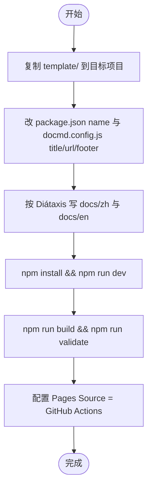

# docmd — 文档站点构建 Skill

本 Skill 说明如何用捆绑的 **docmd + Diátaxis 模版**搭建文档站点，并按同一约定做本地预览、生产构建与 GitHub Pages 部署。

**活示例**：本仓库 [devops-skill](https://github.com/qdriven/devops-skill) 的文档站（[https://qdriven.github.io/devops-skill/](https://qdriven.github.io/devops-skill/)）就是按本模版落地的；仓库根目录的 `docs/`、`docmd.config.js`、`assets/footer.css`、`.github/workflows/deploy-docs.yml` 与 `template/` 同构。

模版目录：[template/](template/)（README 与示例页面也在其中）。

## 何时使用

| 场景 | 做法 |
|------|------|
| 给新项目 / 新 skillset 建文档站 | 复制 `template/`，改配置与内容 |
| 解释 devops-skill 文档站怎么来的 | 对照本 Skill + 仓库根 `docs/` |
| 只改本站现有文档、本地预览 | 不必复制模版；在仓库根跑 `npm run docs:dev` |
| 任意 Markdown 静态站、非 Diátaxis | 不必用本 Skill |

## 模版约定（后续已定稿）

相对最初的最小 `docmd.config` 示例，当前模版固定这些能力（与 devops-skill 站点一致）：

| 项 | 约定 |
|----|------|
| 包 | `@docmd/core`（scripts：`docmd dev/build/validate/doctor`） |
| 源码 / 输出 | `src: 'docs'`，`out: 'site'` |
| 双语 | `i18n`：`default: 'zh'`，`en` 走 `/en/`；语言切换在侧栏 options menu |
| 目录 | Diátaxis 四类：`tutorials/`、`how-to/`、`explanation/`、`reference/` + Landing |
| 页脚 | `footer.style: 'complete'` + `assets/footer.css`（修复 sky 主题页脚裁切） |
| 部署 | `.github/workflows/deploy-docs.yml` → GitHub Pages（Actions，**Node 24 action majors**） |

## 定稿：GitHub Pages workflow（Node 24）

仓库根与模版共用同一份 workflow。**不要**再写 `actions/*@v4`（Node 20 runtime 已弃用）。定稿版本：

| Action | 版本 | 说明 |
|--------|------|------|
| `actions/checkout` | `v6` | Node 24 |
| `actions/setup-node` | `v6` | Node 24；`node-version: "24"` |
| `actions/upload-pages-artifact` | `v5` | 内含 Node 24 系 upload-artifact |
| `actions/deploy-pages` | `v5` | Node 24 |

完整文件见 [template/.github/workflows/deploy-docs.yml](template/.github/workflows/deploy-docs.yml)（与仓库根 `.github/workflows/deploy-docs.yml` 同构）：

```yaml
name: Deploy to GitHub Pages

on:
  push:
    branches:
      - main
  workflow_dispatch:

permissions:
  contents: read
  pages: write
  id-token: write

concurrency:
  group: "pages"
  cancel-in-progress: false

jobs:
  build:
    runs-on: ubuntu-latest
    steps:
      - name: Checkout
        uses: actions/checkout@v6

      - name: Set up Node.js
        uses: actions/setup-node@v6
        with:
          node-version: "24"
          registry-url: https://registry.npmjs.org

      - name: Install dependencies
        run: npm install

      - name: Build docs site
        run: npx docmd build

      - name: Upload Pages artifact
        uses: actions/upload-pages-artifact@v5
        with:
          path: ./site

  deploy:
    environment:
      name: github-pages
      url: ${{ steps.deployment.outputs.page_url }}
    runs-on: ubuntu-latest
    needs: build
    steps:
      - name: Deploy to GitHub Pages
        id: deployment
        uses: actions/deploy-pages@v5
```

参考：[Deprecation of Node 20 on GitHub Actions runners](https://github.blog/changelog/2025-09-19-deprecation-of-node-20-on-github-actions-runners/)。

## 用模版新建文档站



### 步骤

1. **复制模版**（从本 Skill 安装位置或本仓库路径）：

   ```bash
   # 例：从 devops-skill 仓库
   cp -R skillsets/devops-skill/docmd/template/ /path/to/your-project/docs-site
   cd /path/to/your-project/docs-site
   ```

   若文档站就在项目根（与 devops-skill 相同），把 `template/` 内文件摊到仓库根，而不是多套一层目录。

2. **改身份**
   - `package.json` → `name`、`description`
   - `docmd.config.js` → `title`、`url`（形如 `https://<user>.github.io/<repo>`）、`footer.content` / `footer.description` / 页脚链接
   - 按需改 `navigation` 与 `plugins.seo.defaultDescription`

3. **写内容**
   - 中文：`docs/zh/...`（默认语言，站点根路径）
   - English：`docs/en/...`（URL 前缀 `/en/`）
   - Landing（`index.md`）只做导航，不写长文
   - 四类目录各司其职：Tutorial 跟着学 / How-to 按步骤做 / Explanation 讲为什么 / Reference 查规格

4. **本地验证**

   ```bash
   npm install
   npm run dev       # http://localhost:3000
   npm run build     # 输出 site/
   npm run validate  # 内链检查
   ```

5. **GitHub Pages**
   - 使用模版内定稿 `.github/workflows/deploy-docs.yml`（Node 24 action majors；见上一节）
   - 若跑 `npx @docmd/core deploy --github-pages`，生成后核对是否仍为 `@v4`；若是，用定稿版本覆盖
   - 仓库 Settings → Pages → Source 选 **GitHub Actions**
   - 推送到 `main` 触发部署

## Agent 执行要点

- 先读 [template/README.md](template/README.md) 与目标项目现有 `docmd.config.js`，避免覆盖已定制配置。
- 新建站时以 `template/` 为唯一骨架；不要从过时的最小 config 片段手写一整套。
- 修改 devops-skill **自身**文档时：改仓库根 `docs/`，用根目录 `package.json` 的 `docs:dev` / `docs:build`，不要再复制一份 template。
- 双语页面路径与文案应对齐；新增一页通常要同时加 `zh` 与 `en`。

## 与 devops-skill 文档的关系

| 产物 | 路径 | 角色 |
|------|------|------|
| 本 Skill | `docmd/SKILL.md` | 教 Agent **如何**用模版建站 |
| 可复制模版 | `docmd/template/` | 空白起点 + 示例 Diátaxis 页 |
| 活站点源码 | 仓库根 `docs/`、`docmd.config.js` | 模版的真实落地（本 skillset 文档） |
| 操作指南 | `docs/*/how-to/build-docs.md` | 仅构建/预览**本站** |

## 参考

- [docmd](https://github.com/docmd-io/docmd) / [docmd.io](https://docmd.io)
- [Diátaxis](https://diataxis.fr) · [diataxisSkills](https://github.com/trogera/diataxisSkills)
- 模版内：[template/docs/zh/reference/directory-map.md](template/docs/zh/reference/directory-map.md)、[npm-scripts](template/docs/zh/reference/npm-scripts.md)
