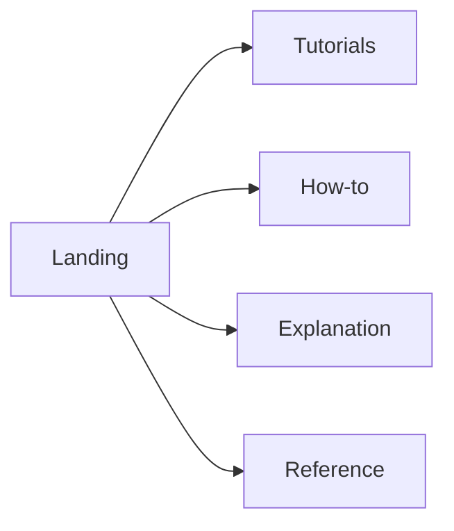

# Why Diátaxis

Documentation fails when one page tries to teach, instruct, explain, and catalog at the same time. Readers arrive with different jobs: learn, do, understand, or look up. Mixing those jobs creates mixed pages that satisfy no one well.

Diátaxis separates documentation into four modes, plus a landing/way-finding page that only helps readers choose:

- **Tutorial** — learning through a guided first success
- **How-to** — achieving a known goal with steps
- **Explanation** — building mental models
- **Reference** — consulting accurate, scannable facts

This template maps those modes to folders so new pages have a default home. Classification skills such as [diataxisSkills](https://github.com/trogera/diataxisSkills) help audit and split mixed legacy pages into this shape.

