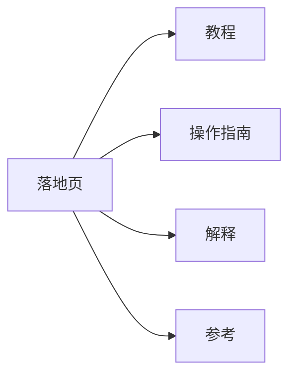

# 为什么用 Diátaxis

当同一页既想教、又想指导操作、又想解释概念、还想当手册时，文档往往会失败。读者带着不同目标到来：学习、完成任务、理解、或查阅。混在一起的页面通常谁都照顾不好。

Diátaxis 把文档拆成四种模式，外加只负责指路的落地页：

- **教程 Tutorial** — 通过引导完成第一次成功来学习
- **操作指南 How-to** — 用步骤达成已知目标
- **解释 Explanation** — 建立心智模型
- **参考 Reference** — 查阅准确、可扫描的事实

本模版把这些模式映射到目录，让新页面有默认归属。可用 [diataxisSkills](https://github.com/trogera/diataxisSkills) 等分类技能审计、拆分混杂的遗留页面。

