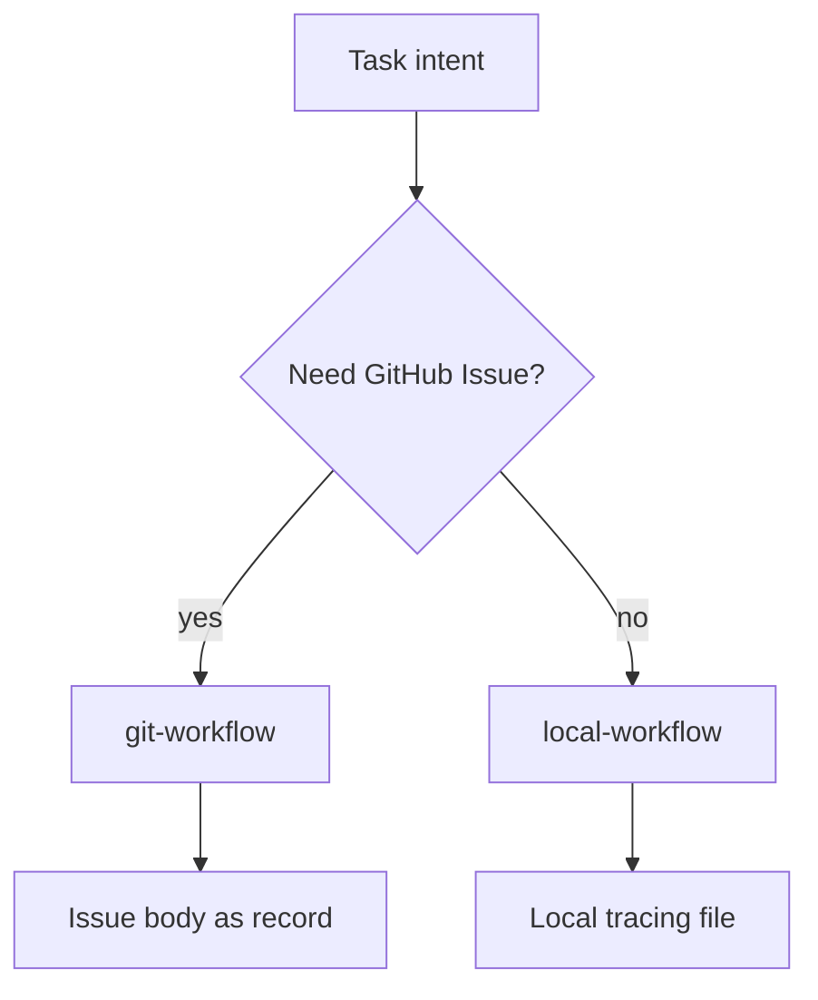

# git-workflow vs local-workflow

Both skills orchestrate “read task → implement → record outcome”. They differ in where the record of truth lives.

| | git-workflow | local-workflow |
|--|--------------|----------------|
| Tracker | GitHub Issue | `tasks/tracing/*.md` |
| Needs GitHub | Yes (`gh`, remote) | No |
| Default commit | Controlled by finish flags / hooks | No commit unless requested |
| Best for | Team visibility, Issue lifecycle | Offline, private, local-only work |

If the user only says “execute task” without specifying GitHub, check for a remote and `gh auth status` before forcing an Issue.
