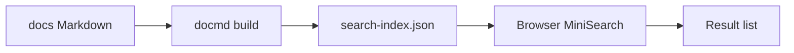

# How site search works

This docs site ships with **offline full-text search** (docmd `@docmd/plugin-search` + MiniSearch). There is no external search API: the index is generated at build time and queried in the browser. That fits GitHub Pages, private networks, and air-gapped previews.

## Why document search at all

Search looks like “a box in the sidebar,” but it behaves differently from many hosted docs products:

- The index is a **build artifact**, not a live crawl
- Chinese and English each have their own index, tied to the active locale
- Opening the built HTML via `file://` will fail search (an HTTP server is required)

Spelling this out reduces false alarms like “search is broken,” “English pages don’t show up,” or “it works on Pages but not when I double-click index.html.”

## How to use it

1. Open the **search** control in the sidebar options menu (magnifying glass / Search)
2. Or press **⌘K** (macOS) / **Ctrl+K** (Windows / Linux) to open the search modal
3. Type a query, move with arrow keys, press **Enter** to open a result, **Esc** to close

The first open loads the index for the current language; you may see a short loading state.

## What it indexes

On build, docmd indexes Markdown pages under `docs/`. Stored fields include:

| Field | Role |
|-------|------|
| `title` | Page title (boosted) |
| `headings` | Section headings |
| `text` | Body text |

This site is bilingual (`zh` / `en`):

- Default locale (Chinese) index: `site/_docmd-search/search-index.json`
- English index: `site/_docmd-search/en/search-index.json`

After you switch language, search loads that locale’s index—so Chinese UI mainly hits Chinese docs, and English UI mainly hits English docs.

## How it works (briefly)

1. `npm run docs:build` (or `docmd build`) parses Markdown and emits the static site plus search indexes
2. When you open search, the client `fetch`es the JSON index and runs MiniSearch with prefix / fuzzy matching
3. Results render entirely client-side—no backend

The plugin is enabled by default; this site keeps `plugins.search: {}` in `docmd.config.js`.

## Limitations

- **Needs a rebuild**: editing Markdown does not update search until you build again
- **Client-side only**: the index downloads with the site; large corpora grow the payload
- **No `file://`**: use a local HTTP server (`npm run docs:dev`) or the deployed Pages URL
- **`--offline` builds**: some offline-oriented build flags disable search
- **Not semantic by default**: keyword / fuzzy match, not LLM understanding (unless you enable semantic mode separately)
- **Locale-scoped**: searching English-only terms from the Chinese locale may miss hits—switch language first

## Related

- [How to build the docs site](../how-to/build-docs.md) — local preview and index generation
- Upstream docs: [docs.docmd.io](https://docs.docmd.io)
