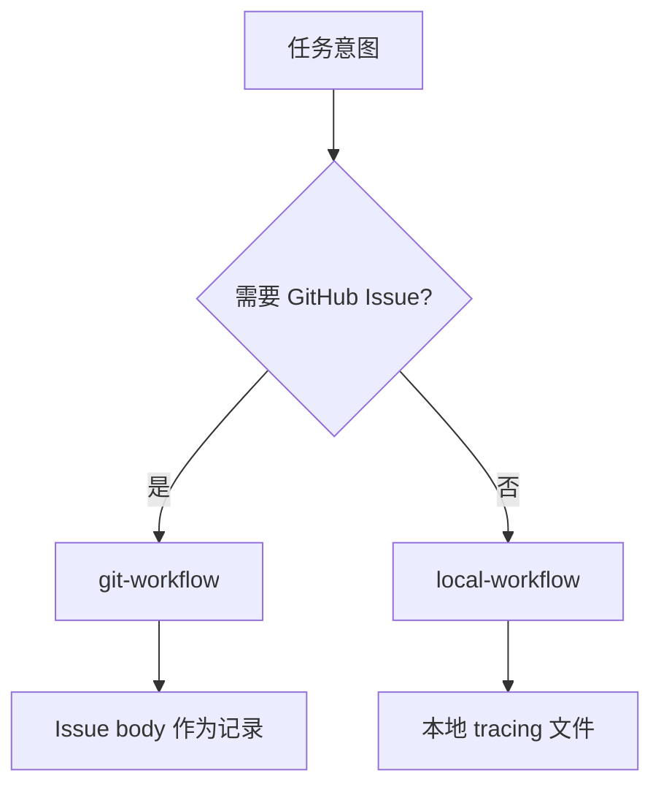

# git-workflow 与 local-workflow

两个 skill 都编排「读任务 → 实现 → 记录结果」，差别在于「真相」写在哪里。

| | git-workflow | local-workflow |
|--|--------------|----------------|
| 追踪载体 | GitHub Issue | `tasks/tracing/*.md` |
| 需要 GitHub | 是（`gh`、remote） | 否 |
| 默认提交 | 由 finish 参数 / hooks 控制 | 除非要求，否则不提交 |
| 适合 | 团队可见、Issue 生命周期 | 离线、私有、仅本地 |

若用户只说「执行任务」而未指定是否用 GitHub，应先检查 remote 与 `gh auth status`，再决定是否创建 Issue。
