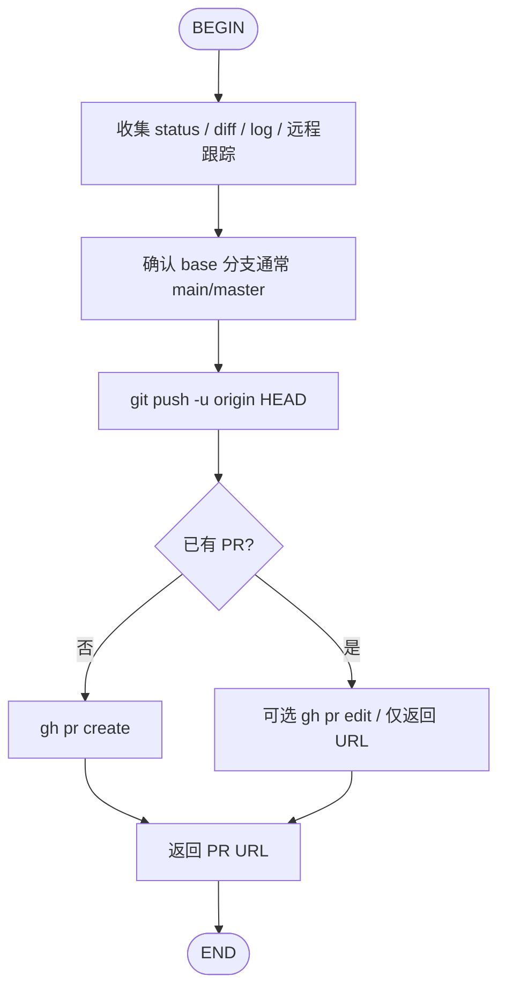

# Git PR

基于 [github-cli-skill](../github-cli-skill/SKILL.md) 的 **Pull Request 工作流**：推送当前（或指定）分支并创建/更新 PR。

## 选择规则

| 场景 | 用哪个 |
|------|--------|
| 用户明确要求开 PR / 推送并创建 PR | **本 Skill（git-pr）** |
| Issue 全生命周期（init → 实现 → close） | [git-workflow](../git-workflow/SKILL.md) |
| 本地追踪、不要 GitHub | [local-workflow](../local-workflow/SKILL.md) |
| 只要单条 `gh` 命令速查 | [github-cli-skill](../github-cli-skill/SKILL.md) |
| 需要隔离目录再改代码开 PR | 先 [git-worktree](../git-worktree/SKILL.md)，再本 Skill |

**与 git-workflow 的关系**：正交且可选。`git-workflow finish` **默认不开 PR**；用户说「开 PR / 走 git-pr」时再触发本 Skill。也可在未跑 git-workflow 的情况下单独使用。

## 工作流步骤



### 步骤说明

1. **STATUS** — 并行收集（在目标仓库根目录）：
   - `git status -sb`
   - `git diff` 与 `git diff --staged`（确认没有未提交必改内容；有则先问用户是否 commit）
   - `git rev-parse --abbrev-ref HEAD`、是否跟踪 remote、`git status -sb` 是否 ahead/behind
   - `git log --oneline $(git merge-base HEAD <base>)..HEAD` 与 `git diff <base>...HEAD`
2. **BASE** — 默认 base 为 `main`，若不存在则试 `master`；可用 `--base` 覆盖。
3. **PUSH** — `git push -u origin HEAD`（需要网络与写权限）。**不要** force push 到 main/master。
4. **CREATE / UPDATE**
   - 已有 PR：`gh pr view --json url -q .url`，除非用户要求改标题/正文，否则直接返回 URL。
   - 否则：`gh pr create`（见下方模板）。若分支名形如 `42-feature`，在 Summary 写 `Closes #42` / `Refs #42`（Issue 已关则用 Refs）。
5. **URL** — 把 PR URL 明确返回给用户。

## PR Body 模板

```bash
gh pr create --base main --title "简洁标题" --body "$(cat <<'EOF'
## Summary
- <1-3 条：为什么改 / 改了什么>

## Test plan
- [ ] <验证步骤>

EOF
)"
```

可选：`--draft`、`--reviewer`、`--label`、关联 Issue 的 `Closes #N`。

## 快速参考

| 操作 | 命令 |
|------|------|
| 推送当前分支 | `git push -u origin HEAD` |
| 创建 PR | `gh pr create --base main --title "..." --body "..."` |
| 查看当前分支 PR | `gh pr view --web` / `gh pr view --json url -q .url` |
| 列出 PR | `gh pr list` |
| 检查 CI | `gh pr checks` |

## Agent 行为约定

1. 用户只说「执行任务」且未提 PR → **不要**自动开 PR；走 git-workflow / local-workflow 即可。
2. 用户说「开 PR」「走 git-pr」「提交 PR」→ **读本 Skill 并执行**。
3. 有未提交改动时先说明，征得同意再 commit（遵循用户的 commit 规则），再 push/create。
4. 永远不更新 git config；不 force push main/master；不跳过 hooks。
5. 完成后必须给出可点击的 PR URL。

## 与 git-workflow 的衔接（可选）

```text
git-workflow init → (worktree?) → implement → finish
        └─ 用户要求开 PR 时 → git-pr（push + gh pr create，Refs/Closes Issue）
```

在 `finish` 的 Result 里可记一句「PR：\<url\>」；本 Skill 不负责关 Issue。

## 相关

| Skill / 文档 | 说明 |
|--------------|------|
| [git-workflow](../git-workflow/SKILL.md) | Issue 生命周期；finish 后可选接本 Skill |
| [git-worktree](../git-worktree/SKILL.md) | 隔离实现目录与分支 |
| [github-cli-skill](../github-cli-skill/SKILL.md) | 零散 `gh` 命令 |
| [local-workflow](../local-workflow/SKILL.md) | 无 GitHub 的本地追踪 |
