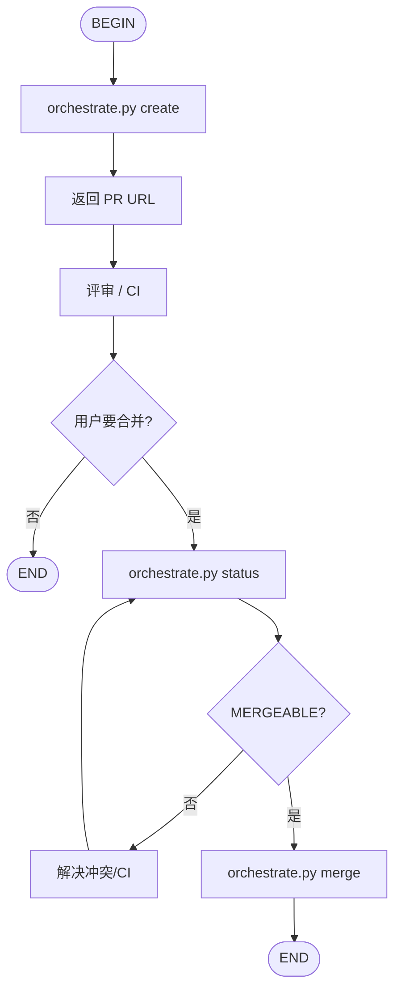

# Git PR

基于 [github-cli-skill](../github-cli-skill/SKILL.md) 的 **Pull Request 工作流**：创建 / 查询 / 合并 PR。

**推荐用脚本，而不是手写一长串 `gh`。** 与 `git-workflow` 一样，流程入口是 `scripts/orchestrate.py`。

## 选择规则

| 场景 | 用哪个 |
|------|--------|
| 用户明确要求开 PR / 合并 PR | **本 Skill（git-pr）** |
| Issue 全生命周期（init → 实现 → close） | [git-workflow](../git-workflow/SKILL.md) |
| 本地追踪、不要 GitHub | [local-workflow](../local-workflow/SKILL.md) |
| 只要单条 `gh` 命令速查 | [github-cli-skill](../github-cli-skill/SKILL.md) |
| 需要隔离目录再改代码开 PR | 先 [git-worktree](../git-worktree/SKILL.md)，再本 Skill |

**与 git-workflow 的关系**：正交且可选。`git-workflow finish` **默认不开/不合并 PR**；用户说「开 PR / 合并 PR / 走 git-pr」时再触发本 Skill。

## 脚本入口（首选）

路径（按安装位置择一）：

```bash
python3 .agents/skills/git-pr/scripts/orchestrate.py <command> ...
# 或系统安装：
python3 ~/.claude/skills/git-pr/scripts/orchestrate.py <command> ...
```

| 命令 | 作用 |
|------|------|
| `create --title "..." --body "..."` | `git push -u` + `gh pr create`（已有 PR 则返回 URL） |
| `status [--pr N]` | 查看 mergeable / checks |
| `merge [--pr N] [--method squash\|merge\|rebase]` | 合并 PR（默认 squash，默认删远端头部分支） |

### create

```bash
python3 ~/.claude/skills/git-pr/scripts/orchestrate.py create \
  --title "Add feature X" \
  --body "$(cat <<'EOF'
## Summary
- Why / what

## Test plan
- [ ] steps

EOF
)" \
  --base main
```

可选：`--draft`、`--repo owner/name`。状态写入 `.git-pr.state.json`。

### status

```bash
python3 ~/.claude/skills/git-pr/scripts/orchestrate.py status
python3 ~/.claude/skills/git-pr/scripts/orchestrate.py status --pr 2
```

### merge

**仅在用户明确要求合并时执行。** 先 `status` 确认 `MERGEABLE` / 无冲突。

```bash
# 默认：squash + 删除远端头部分支
python3 ~/.claude/skills/git-pr/scripts/orchestrate.py merge --pr 2

# 保留分支 / 换合并方式
python3 ~/.claude/skills/git-pr/scripts/orchestrate.py merge --pr 2 --method merge --keep-branch
```

护栏：

- 拒绝从 `main`/`master` 上 `create`
- `merge` 前检查 PR 为 `OPEN`，且非 `CONFLICTING`
- **不** force push；不改 git config；不默认 `--admin`（需显式传）

## 工作流



## Agent 行为约定

1. 开 PR / 合并 PR → **优先跑 `orchestrate.py`**，不要只贴一串手写 `gh`。
2. 用户未说「合并」→ 只 create/status，**不要**自动 merge。
3. 有未提交改动时先征得同意再 commit，再 create。
4. 完成后给出可点击的 PR URL（merge 后说明已 MERGED）。

## 与 git-workflow 的衔接（可选）

```text
git-workflow init → (worktree?) → implement → finish
        └─ 开 PR → git-pr create
        └─ 合并 PR → git-pr merge（需用户明确要求）
```

## 相关

| Skill / 文档 | 说明 |
|--------------|------|
| [git-workflow](../git-workflow/SKILL.md) | Issue 生命周期；finish 后可选接本 Skill |
| [git-worktree](../git-worktree/SKILL.md) | 隔离实现目录与分支 |
| [github-cli-skill](../github-cli-skill/SKILL.md) | 零散 `gh` 命令 |
| [local-workflow](../local-workflow/SKILL.md) | 无 GitHub 的本地追踪 |
