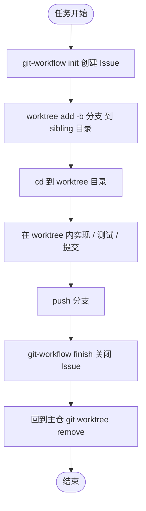

# Git Worktree

用 `git worktree` 做**隔离开发**：同一仓库、多份工作目录，各自检出不同分支，共享对象库与历史。

详细命令与约束见 [references/commands.md](references/commands.md)。

## 何时使用

| 场景 | 做法 |
|------|------|
| 主线未提交改动还在，要另开 hotfix / 并行任务 | `worktree add -b …` |
| AI Agent / IDE 需要干净目录，不弄脏主工作区 | 为任务建 linked worktree |
| 一边跑长构建/测试，一边改另一分支 | 各用一个 worktree |
| 只需切换分支、可接受 stash / 脏工作区 | 不必用 worktree |

**不要**用 worktree 解决权限/机器边界隔离——那种场景再 clone。

## 与任务工作流的关系

可以、也**应该**在 `git-workflow` / `local-workflow` 里引用本 Skill：

| 工作流 | 职责 | worktree 职责 |
|--------|------|----------------|
| [git-workflow](../git-workflow/SKILL.md) | Issue 生命周期（init → 实现 → finish） | 实现阶段的**工作目录与分支隔离** |
| [local-workflow](../local-workflow/SKILL.md) | 本地 tracing | 同上 |

三者正交：追踪归 workflow；目录/分支隔离归 worktree。

## 推荐开发流程（配合 git-workflow）



### 步骤

1. **INIT** — 按 [git-workflow](../git-workflow/SKILL.md) 创建 Issue，拿到编号 `N`。
2. **ADD worktree** — 从主仓（main worktree）执行，勿在已占用分支上重复检出：

   ```bash
   # 约定：分支名以 Issue 编号开头，便于 prepare-commit-msg 追加 Refs
   REPO_NAME="$(basename "$(git rev-parse --show-toplevel)")"
   git worktree add -b "${N}-short-slug" "../${REPO_NAME}-wt-${N}" main
   cd "../${REPO_NAME}-wt-${N}"
   ```

3. **IMPLEMENT** — 在 **worktree 目录**里改代码、跑测试、commit。状态文件（如 `.git-workflow.state.json`）写在当前工作树根；完成前保持 cwd 在该 worktree。
4. **PUSH**（需要时）— `git push -u origin HEAD`。
5. **FINISH** — 仍在 worktree 内跑 `orchestrate.py finish`（或回到写过状态文件的那棵树）。
6. **REMOVE** — 任务结束后清理：

   ```bash
   cd /path/to/main-repo
   git worktree remove "../${REPO_NAME}-wt-${N}"
   # 若曾手动删目录：git worktree prune
   ```

### 配合 local-workflow

流程相同：先 `worktree add`，在 worktree 内 `orchestrate.py init` → 实现 → `finish`，最后 `worktree remove`。不创建 GitHub Issue。

## Agent 行为约定

1. 用户要求隔离开发 / worktree / 并行分支时，**先读本 Skill**，再决定是否同时走 git-workflow 或 local-workflow。
2. 已走 git-workflow 且用户希望隔离实现时：在 PLAN/IMPLEMENT 之间插入 worktree 步骤；分支名优先 `{issue}-{slug}`。
3. **同一分支不能被两个 worktree 同时检出**；冲突时用 `-b` 新分支或 `--detach`。
4. 删除用 `git worktree remove`，不要只 `rm -rf`；残留用 `prune`。
5. 依赖目录（如 `node_modules`）通常**不共享**，新 worktree 需各自安装。
6. 主 worktree 有未提交改动时，优先 worktree，而不是 stash 后硬切分支。

## 最小命令

```bash
git worktree list
git worktree add -b feature/foo ../repo-feature-foo main
git worktree remove ../repo-feature-foo
git worktree prune
```

## 相关

| 文档 | 说明 |
|------|------|
| [references/commands.md](references/commands.md) | 命令、约束、与再 clone 对比 |
| [git-workflow](../git-workflow/SKILL.md) | GitHub Issue 任务工作流 |
| [local-workflow](../local-workflow/SKILL.md) | 本地追踪任务工作流 |
